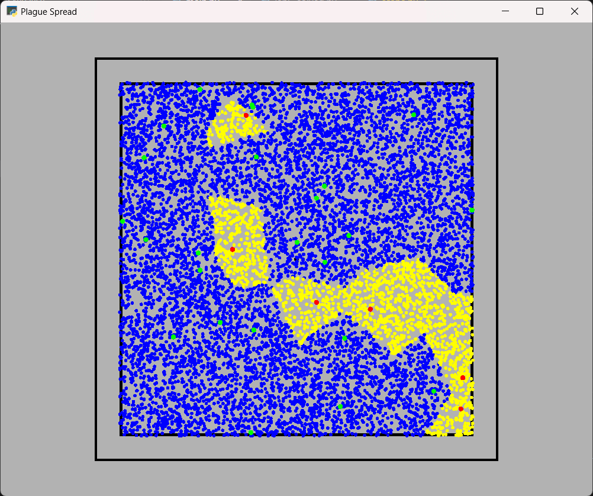
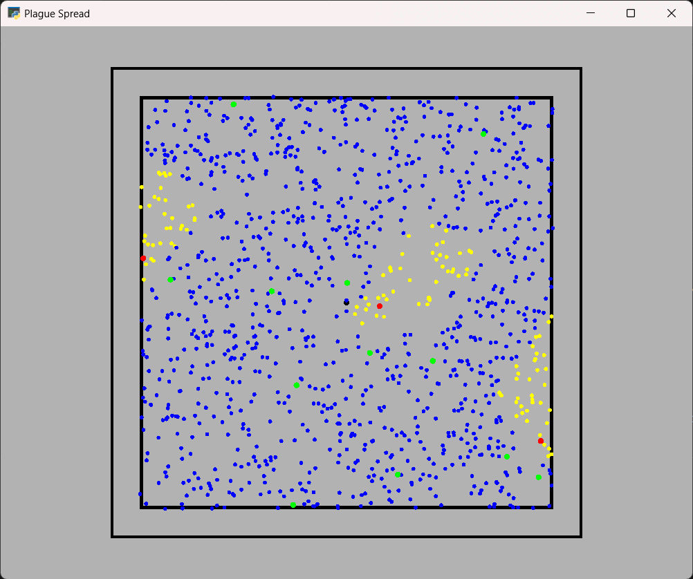

# 3Δ Υπολογιστική Γεωμετρία & Όραση - Πανεπιστήμιο Πατρών 2024
# Plague Spread
Κοσμάς Αρχοντής 1084020

## Ολοκληρωμένα Ερωτήματα:
1. Δειγματοληψία πληθυσμού & πηγαδιών
2. Μόλυνση πηγαδιών, κοντινότερου πληθυσμού
3. Τυχαία μόλυνση πληθυσμού, δημιουργία gifs

## Εκκρεμότητες
1. Ολοκλήρωση υλοποίησης του αλγορίθμου Fortune για το διάγραμμα Voronoi (χρησιμοποιείται scipy.spatial.Voronoi)
2. Ολοκλήρωση δράσεων μόλυνσεως, αποφάσεων με το Voronoi.
3. Μέρος Β

## Οδηγίες Χρήσης
1. Πρέπει να βρισκόμαστε στο σωστό anaconda περιβάλλον
2. Τρέχουμε το main.py
3. Αλληλεπιδρούμε με τη σκηνή μέσω τερματικού
4. Με τα νούμερα 1, 2 αλλάζουμε στο αντίστοιχο σενάριο. Το σενάριο 2 είναι με περισσότερο πληθυσμό/πηγάδια.
5. Με το πάνω βέλος εισερχόμαστε σε TRIAL MODE, χρήσιμο μόνο παρατήρηση συμπεριφοράς με μικρά νούμερα
6. Με αριστερό κλικ ποντικιού προσθέτουμε/αφαιρούμε πηγάδι. Με δεξί μολύνουμε/απο-μολύνουμε πηγάδι
7. Με το πλήκτρο V, παρουσιάζουμε το διάγραμμα Voronoi.
8. Με το πλήκτρο R, ο πληθυσμός επιλέγει πηγάδια με τυχαιότητα. Με P, SHIFT + P πειράζουμε τις πιθανότητες.

Πιο λεπτομερείς οδηγίες, όπως φαίνονται στο πρόγραμμα:

> --> Press ENTER to reset the scene & print instructions.\
--> Press BACKSPACE to print the scenario parameters.\
--> Press UP to toggle between trial mode and normal mode.\
--> Press RIGHT or LEFT to increase or decrease the number of wells.\
--> Press M or N to increase or decrease the population.\
--> Press 1 or 2 to set the scenario to version 1 or 2.\
--> Press V to toggle the Voronoi diagram.\
--> Press LEFT MOUSE BUTTON to add or remove a well.\
--> Press RIGHT MOUSE BUTTON to infect or disinfect a well.\
--> Press R to toggle between deterministic and stochastic scenario.\
-->---> Press P to reduce the probability of choosing the closest well.\
-->---> Press SHIFT, and then P to increase the probability of choosing the closest well.\
