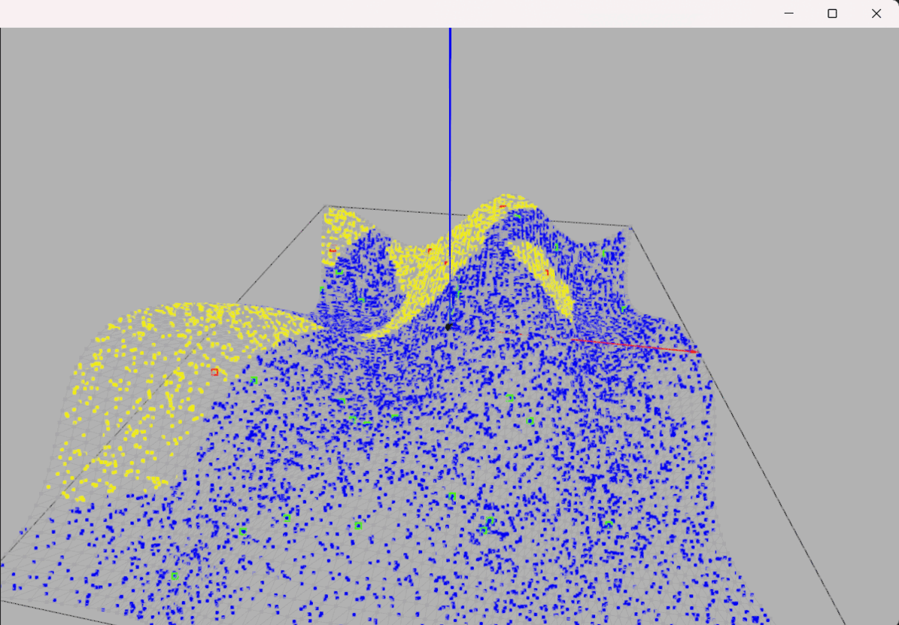

# 3Δ Υπολογιστική Γεωμετρία & Όραση - Πανεπιστήμιο Πατρών 2024
# Plague Spread
Κοσμάς Αρχοντής 1084020

## Showcase
https://github.com/user-attachments/assets/4111d4b8-7c4d-46a9-910e-0e6b72d178b8

## GIFs

## Ολοκληρωμένα Ερωτήματα:
1. Δειγματοληψία πληθυσμού & πηγαδιών
2. Μόλυνση πηγαδιών, κοντινότερου πληθυσμού
3. Τυχαία μόλυνση πληθυσμού, δημιουργία gifs

4. Δημιουργία 3Δ σκηνής, πλέγματος, ύψωση σύμφωνα με Perlin Noise
5. Επανάληψη 2,3 με γεωδαισιακές αποστάσεις
6. Υπολογισμός για elevation
7. 3DTerrain και προσαρμογή γράφου

## Οδηγίες Χρήσης
1. Πρέπει να βρισκόμαστε στο σωστό anaconda περιβάλλον
2. Τρέχουμε το main.py
3. Διαλέγουμε τη 2Δ ή 3Δ σκηνή μέσω τερματικού
3. Αλληλεπιδρούμε με την επιλεγμένη σκηνή μέσω τερματικού
4. Με τα νούμερα 1, 2, 3 αλλάζουμε στο αντίστοιχο σενάριο. Τα σενάρια 2,3 είναι με περισσότερο πληθυσμό/πηγάδια.
5. Με το πάνω βέλος εισερχόμαστε σε TRIAL MODE, χρήσιμο μόνο για παρατήρηση συμπεριφοράς με μικρά νούμερα
6. Με αριστερό κλικ ποντικιού προσθέτουμε/αφαιρούμε πηγάδι. Με δεξί μολύνουμε/απο-μολύνουμε πηγάδι
7. Με το πλήκτρο V, παρουσιάζουμε το διάγραμμα Voronoi.
8. Με το πλήκτρο R, ο πληθυσμός επιλέγει πηγάδια με τυχαιότητα. Με P, SHIFT + P πειράζουμε τις πιθανότητες.

Πιο λεπτομερείς οδηγίες, όπως φαίνονται στο πρόγραμμα:

> --> Press ENTER to reset the scene & print instructions.\
--> Press BACKSPACE to print the scenario parameters.\
--> Press UP to toggle between trial mode and normal mode.\
--> Press RIGHT or LEFT to increase or decrease the number of wells.\
--> Press M or N to increase or decrease the population.\
--> Press 1 or 2 to set the scenario to version 1 or 2.\
--> Press V to toggle the Voronoi diagram.\
--> Press SHIFT + V to use the Voronoi diagram for computations.
--> Press LEFT MOUSE BUTTON to add or remove a well.\
--> Press RIGHT MOUSE BUTTON to infect or disinfect a well.\
--> Press R to toggle between deterministic and stochastic scenario.\
-->---> Press P to reduce the probability of choosing the closest well.\
-->---> Press SHIFT, and then P to increase the probability of choosing the closest well.\

>--> Press ENTER to reset the scene & print instructions.\
--> Press BACKSPACE to print the scenario parameters.\
--> Press UP to toggle between trial mode and normal mode.\
--> Press RIGHT or LEFT to increase or decrease the number of wells.\
--> Press M or N to increase or decrease the population.\
--> Press 1 or 2 to set the scenario to version 1 or 2.\
--> Press W to toggle dense regions of the population.\
--> Press E to toggle between geodesic and euclidean distances.\
--> Press G to consider the elevation in distance calculations.\
--> Press V to toggle the Voronoi diagram.\
--> Press SHIFT + V to use the Voronoi diagram for computations.\
--> Press SHIFT + LEFT MOUSE BUTTON to add or remove a well.\
--> Press SHIFT + LEFT MOUSE BUTTON to infect or disinfect a well.\
--> Press R to toggle between deterministic and stochastic scenario.\
Debug: ----------------------------\
--> Press ALT + UP to show matrices of the grid. Default: uphills, downhills.\
--> Press ALT + LEFTMOUSE to set the start point of the path (euclidean, geodesic or elevation aware).\
--> Press ALT + RIGHTMOUSE to set the end point of the path (euclidean, geodesic or elevation aware).\
--> Press ALT + LEFT or RIGHT to change the color of the grid.\
--> Press ALT + C to toggle the visibility mode of the mesh.\
--> Press ALT + SPACE to clear the debug shapes.\
